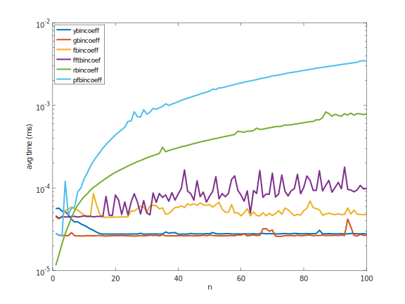
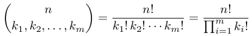
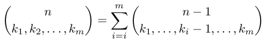
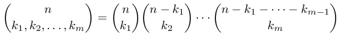
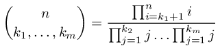
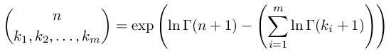
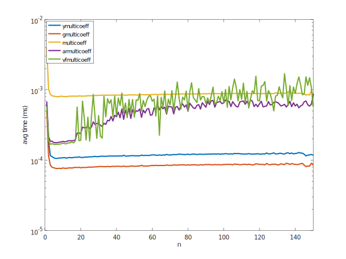
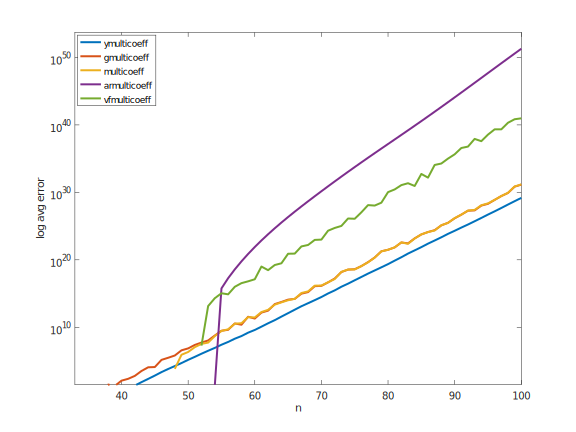

1. Binomial coefficient computation ([bincoeff](#bincoeff))
2. Multinomial coefficient computation ([multicoeff](#multicoeff))

[](https://zenodo.org/badge/latestdoi/187116260)

<br/><br/>

<br/><br/>

# bincoeff <a name="bincoeff"></a>
binomial coefficient computation

The following methods are available here:
1. Pascal recursion [pbincoeff.m](#pbincoeff) ([code](pbincoeff.m))
2. Rolfe recursion  [rbincoeff.m](#rbincoeff) ([code](rbincoeff.m))
3. Yannis iterative method [ybincoeff.m](#ybincoeff) ([code](ybincoeff.m))
4. Prime factorization [pfbincoeff.m](#pfbincoeff) ([code](pfbincoeff.m))
5. Gamma function [gbincoeff.m](#gbincoeff) ([code](gbincoeff.m))
6. FFT method [fftbincoeff.m](#fftbincoeff) ([code](fftbincoef.m))
7. DFT based method [fbincoeff.m](#fbincoeff) ([code](fbincoef.m))

Python implementation using the [bigfloat](https://pypi.org/project/bigfloat/) package for arbitrary-precision, which is a wrapper around the [GNU MPFR library](https://www.mpfr.org/).
1. Yannis iterative method [ybincoeff.py](#pyybincoeff) ([code](ybincoeff.py))
2. DFT based method [fbincoeff.py](#pyfbincoeff) ([code](fbincoeff.py))

Benchmark:
1. execution time benchmark [bincoeffbenchmark.m](#bincoeffbenchmarkerror)
2. execution time benchmark computing a list o values (fixed n) [bincoeffbenchmarkvector.m](#bincoeffbenchmarkvector)
3. error benchmark for large values of n [bincoeffbenchmarkerror.m](#bincoeffbenchmarkerror)

Floating-point precision in computing the factorial:
1. Direct implementation in C of a factorial as a product [factorial.c](#factorialc) ([code](factorial.c))


## pbincoeff.m <a name="pbincoeff"></a>
[see code here](pbincoeff.m)

This function implements the Pascal's recursion. 


```
octave:1> for n=0:10, for k=0:n, printf('%d\t',pbincoeff(n,k)); end; printf('\n'); end;
1	
1	1	
1	2	1	
1	3	3	1	
1	4	6	4	1	
1	5	10	10	5	1	
1	6	15	20	15	6	1	
1	7	21	35	35	21	7	1	
1	8	28	56	70	56	28	8	1	
1	9	36	84	126	126	84	36	9	1	
1	10	45	120	210	252	210	120	45	10	1	
```

## rbincoeff.m <a name="rbincoeff"></a>
[see code here](rbincoeff.m)

This function implements the Rolfe's recursion.

Timothy Rolfe, Binomial coefficient recursion, *Association for Computing Machinery (ACM)*, 33, 2, 2001.


```
octave:1> for n=0:10, for k=0:n, printf('%d\t',rbincoeff(n,k)); end; printf('\n'); end;
1	
1	1	
1	2	1	
1	3	3	1	
1	4	6	4	1	
1	5	10	10	5	1	
1	6	15	20	15	6	1	
1	7	21	35	35	21	7	1	
1	8	28	56	70	56	28	8	1	
1	9	36	84	126	126	84	36	9	1	
1	10	45	120	210	252	210	120	45	10	1	
```

## ybincoeff.m <a name="ybincoeff"></a>
[see code here](ybincoeff.m)

This function implements an iterative method proposed by Yannis Manolopoulos. It performs divisions and multiplications alternatively to avoid overflow.

Yannis Manolopoulos, Binomial coefficient recursion, *Association for Computing Machinery (ACM)*, 34, 4, 2002.


```
octave:1> for n=0:10, for k=0:n, printf('%d\t',ybincoeff(n,k)); end; printf('\n'); end;
1	
1	1	
1	2	1	
1	3	3	1	
1	4	6	4	1	
1	5	10	10	5	1	
1	6	15	20	15	6	1	
1	7	21	35	35	21	7	1	
1	8	28	56	70	56	28	8	1	
1	9	36	84	126	126	84	36	9	1	
1	10	45	120	210	252	210	120	45	10	1	
```

## pfbincoeff.m <a name="pfbincoeff"></a>
[see code here](pfbincoeff.m)

This method uses the same formulation used by Yannis but solve it by finding the prime factors in the denominator and cancel terms in the numerator.


```
octave:1> for n=0:10, for k=0:n, printf('%d\t',pfbincoeff(n,k)); end; printf('\n'); end;
1	
1	1	
1	2	1	
1	3	3	1	
1	4	6	4	1	
1	5	10	10	5	1	
1	6	15	20	15	6	1	
1	7	21	35	35	21	7	1	
1	8	28	56	70	56	28	8	1	
1	9	36	84	126	126	84	36	9	1	
1	10	45	120	210	252	210	120	45	10	1	
```

## gbincoeff.m <a name="gbincoeff"></a>
[see code here](gbincoeff.m)

This approach uses the gamma function to express the factorials.


```
octave:1> for n=0:10, for k=0:n, printf('%d\t',gbincoeff(n,k)); end; printf('\n'); end;
1	
1	1	
1	2	1	
1	3	3	1	
1	4	6	4	1	
1	5	10	10	5	1	
1	6	15	20	15	6	1	
1	7	21	35	35	21	7	1	
1	8	28	56	70	56	28	8	1	
1	9	36	84	126	126	84	36	9	1	
1	10	45	120	210	252	210	120	45	10	1	

```


## fftbincoeff.m <a name="fftbincoeff"></a>
[see code here](fftbincoeff.m)

This approach uses FFT to compute all binomial coefficients in a row for a given n.

Using the following convention,


we may write


```
octave:519> for n=0:10, disp(fftbincoeff(n)); end;
   1   0
   1   1
   1   2   1
   1   3   3   1
   1   4   6   4   1
    1    5   10   10    5    1
    1    6   15   20   15    6    1
    1    7   21   35   35   21    7    1
    1    8   28   56   70   56   28    8    1
     1     9    36    84   126   126    84    36     9     1
     1    10    45   120   210   252   210   120    45    10     1

```


## fbincoeff.m <a name="fbincoeff"></a>
[see code here](fbincoeff.m)

This approach uses DFT.


```
octave:520> for n=0:10, for k=0:n, printf('%d\t',fbincoeff(n,k)); end; printf('\n'); end;
1	
1	1	
1	2	1	
1	3	3	1	
1	4	6	4	1	
1	5	10	10	5	1	
1	6	15	20	15	6	1	
1	7	21	35	35	21	7	1	
1	8	28	56	70	56	28	8	1	
1	9	36	84	126	126	84	36	9	1	
1	10	45	120	210	252	210	120	45	10	1	
```


## ybincoeff.py <a name="pyybincoeff"></a>
[see code here](ybincoeff.py)

```
$ ./ybincoeff.py 1000 353 1003
25229445633065974235144080252055773735613043515311956893635594388544559689184803330180149528141512945359658556166399392346118918439771509194920459520556252295683805332098882502374636769258037666692232812592768678750591171883227016115891467430491067982639472436653138035382214107000
```


## fbincoeff.py <a name="pyfbincoeff"></a>
[see code here](fbincoeff.py)

```
$ ./fbincoeff.py 1000 353 1003
25229445633065974235144080252055773735613043515311956893635594388544559689184803330180149528141512945359658556166399392346118918439771509194920459520556252295683805332098882502374636769258037666692232812592768678750591171883227016115891467430491067982639472436653138035382214107000
```

## bincoeffbenchmark.m <a name="bincoeffbenchmarkerror"></a>
[see code here](bincoeffbenchmark.m)

execution time benchmark




## bincoeffbenchmarkvector.m <a name="bincoeffbenchmarkvector"></a>
[see code here](bincoeffbenchmarkvector.m)

execution time benchmark computing a list o values (fixed n)


## bincoeffbenchmarkerror.m <a name="bincoeffbenchmarkerror"></a>
[see code here](bincoeffbenchmarkerror.m)

error benchmark for large values of n


## factorial.c <a name="factorialc"></a>
[see code here](factorial.c)
```
$ gcc factorial.c -lgmp -o factorial
$ ./factorial 10
10	3628800 (32 bits)	3628800 (32 bits)	3628800 (32 bits)	3628800 (64 bits)	3628800 (128 bits)
$ { echo -e 'n\tint\tuint\tfloat\tdouble\tGMP'; for k in $(seq 1 20); do ./factorial $k | sed -e 's/([^()]*)//g'; done; } | column -t 
n   int          uint        float                double               GMP
1   1            1           1                    1                    1
2   2            2           2                    2                    2
3   6            6           6                    6                    6
4   24           24          24                   24                   24
5   120          120         120                  120                  120
6   720          720         720                  720                  720
7   5040         5040        5040                 5040                 5040
8   40320        40320       40320                40320                40320
9   362880       362880      362880               362880               362880
10  3628800      3628800     3628800              3628800              3628800
11  39916800     39916800    39916800             39916800             39916800
12  479001600    479001600   479001600            479001600            479001600
13  1932053504   1932053504  6227020800           6227020800           6227020800
14  1278945280   1278945280  87178289152          87178291200          87178291200
15  2004310016   2004310016  1307674279936        1307674368000        1307674368000
16  2004189184   2004189184  20922788478976       20922789888000       20922789888000
17  -288522240   4006445056  355687414628352      355687428096000      355687428096000
18  -898433024   3396534272  6402373530419200     6402373705728000     6402373705728000
19  109641728    109641728   121645096004222976   121645100408832000   121645100408832000
20  -2102132736  2192834560  2432902023163674624  2432902008176640000  2432902008176640000
```


# multicoeff <a name="multicoeff"></a>
multinomial coefficient computation



The following methods are available here:
1. Generalized Pascal's recursion [rmulticoeff.m](#rmulticoeff) ([code](rmulticoeff.m))
2. FFT accelerated Rolfe's recursion method  [armulticoeff.m](#armulticoeff) ([code](armulticoeff.m))
3. FFT accelerated Vandermonde's convolution [vfmulticoeff.m](#vfmulticoeff) ([code](vfmulticoeff.m))
4. Extended Yannis iterative method [ymulticoeff.m](#ymulticoeff) ([code](ymulticoeff.m))
5. Product of binomials and gamma function [multicoeff.m](#multicoeff) ([code](multicoeff.m))
6. Gamma function [gmulticoeff.m](#gmulticoeff) ([code](gmulticoeff.m))


Arbitrary-precision arithmetic implementation:
1. Implementation in C of the extended Yannis iterative method using [the GNU Multiple Precision Arithmetic Library](https://gmplib.org/) [ymulticoeff.c](#ymulticoeffc) ([code](ymulticoeff.c))

Benchmark:
1. Execution time and error benchmark [multicoeffbenchmarkerror.m](#multicoeffbenchmarkerror)

Table:
1. Create a table of multinomial coeffcients [multicoefftable.sh](#multicoefftable)


## rmulticoeff.m <a name="rmulticoeff"></a>
[see code here](rmulticoeff.m)

This function implements the generalized Pascal's recursion to compute multinomials coefficients. 



```
octave:1> tic; c = rmulticoeff ([1 2 3]); toc, c
Elapsed time is 0.0132861 seconds.
c = 60
octave:2> tic; c = rmulticoeff ([3 4 5]); toc, c
Elapsed time is 2.6084 seconds.
c = 27720
octave:3> tic; c = rmulticoeff ([5 5 5]); toc, c
Elapsed time is 70.7959 seconds.
c = 756756
```


## armulticoeff.m <a name="armulticoeff"></a>
[see code here](armulticoeff.m)

Using the following relation



we note that the first coefficient is one. We may compute the second using FFT method (computing all coeffcients for the given level). The following coefficients in the equation above are computed by a recursion that goes until the level of the second coefficient (it is not necessary to go all the way up, if the coefficients at a given level are already computed).

```
octave:1> tic; c = armulticoeff ([5 5 5]); toc, c
Elapsed time is 0.00154495 seconds.
c = 756756
octave:2> tic; c = armulticoeff ([10 10 10]); toc, c
Elapsed time is 0.0024488 seconds.
c = 5550996791340
```


## vfmulticoeff.m <a name="vfmulticoeff"></a>
[see code here](vfmulticoeff.m)

Using the following relation, we may compute the multinomial coefficient by a product of binomial coefficients.


The first coefficient is one and the second is computed by FFT. The following coeffcieints might be computed by a Chu-Vandermonde's convolution:


We realize that these coefficients might be computed by FFT just peforming a cumulative product (convolution in FFT domain).

```
octave:1> tic; c = vfmulticoeff ([10 10 10]); toc, c
Elapsed time is 0.00150704 seconds.
c = 5550996791340
```


## ymulticoeff.m <a name="ymulticoeff"></a>
[see code here](ymulticoeff.m)

This function implements the extended version of Yannis iterative method, described in the equation bellow. The elements in the numerator and denominator are sorted in descending order to avoid overflow.



```
octave:1> tic; c = ymulticoeff ([10 10 10]); toc, c
Elapsed time is 0.000590801 seconds.
c = 5550996791340
```


## multicoeff.m <a name="multicoeff"></a>
[see code here](multicoeff.m)

The multinomial coefficient is expressed by 


and each binomial coeffcient is computed by the defaul GNU Octave's function bincoeff (which uses gamma funcion).

```
octave:1> tic; c = multicoeff ([10 10 10]); toc, c
Elapsed time is 0.00184298 seconds.
c = 5550996791340
```


## gmulticoeff.m <a name="gmulticoeff"></a>
[see code here](gmulticoeff.m)

The multinomial coefficient is expressed by gamma functions:




```
octave:1> tic; c = gmulticoeff ([10 10 10]); toc, c
Elapsed time is 0.000368834 seconds.
c = 5550996791340
```


## ymulticoeff.c <a name="ymulticoeffc"></a>
[see code here](ymulticoeff.c)

This function implements the extended version of Yannis iterative method using the GMP arbitrary-precision arithmetic library.


```
$ ./ymulticoeff 30 30 30
79607789567531236214600000000000000000000
$ ./ttic.sh && ./ymulticoeff 100 100 100 && ./ttoc.sh 
376523493564631064367000000000000000000000000000000000000000000000000000000000000000000000000000000000000000000000000000000000000000000000000
0.006
```
Using ttic and ttoc utility from [swarminglogic](https://gist.github.com/swarminglogic/87adb0bd0850d76ba09f).


## multicoeffbenchmarkerror.m <a name="multicoeffbenchmarkerror"></a>
[see code here](multicoeffbenchmarkerror.m)


execution time benchmark




error benchmark for large values of n




## multicoefftable.sh <a name="multicoefftable"></a>
[see code here](multicoefftable.sh)

Creating a table of all the multinomial coefficients for n=4 and m=3.

```
$ ./multicoefftable.sh 4 3 | column -c 80
0,0,0	1	1,0,0	1	2,0,0	1	3,0,0	1	4,0,0	1
0,0,1	1	1,0,1	2	2,0,1	3	3,0,1	4	4,0,1	5
0,0,2	1	1,0,2	3	2,0,2	6	3,0,2	10	4,0,2	15
0,0,3	1	1,0,3	4	2,0,3	10	3,0,3	20	4,0,3	35
0,0,4	1	1,0,4	5	2,0,4	15	3,0,4	35	4,0,4	70
0,1,0	1	1,1,0	2	2,1,0	3	3,1,0	4	4,1,0	5
0,1,1	2	1,1,1	6	2,1,1	12	3,1,1	20	4,1,1	30
0,1,2	3	1,1,2	12	2,1,2	30	3,1,2	60	4,1,2	105
0,1,3	4	1,1,3	20	2,1,3	60	3,1,3	140	4,1,3	280
0,1,4	5	1,1,4	30	2,1,4	105	3,1,4	280	4,1,4	630
0,2,0	1	1,2,0	3	2,2,0	6	3,2,0	10	4,2,0	15
0,2,1	3	1,2,1	12	2,2,1	30	3,2,1	60	4,2,1	105
0,2,2	6	1,2,2	30	2,2,2	90	3,2,2	210	4,2,2	420
0,2,3	10	1,2,3	60	2,2,3	210	3,2,3	560	4,2,3	1260
0,2,4	15	1,2,4	105	2,2,4	420	3,2,4	1260	4,2,4	3150
0,3,0	1	1,3,0	4	2,3,0	10	3,3,0	20	4,3,0	35
0,3,1	4	1,3,1	20	2,3,1	60	3,3,1	140	4,3,1	280
0,3,2	10	1,3,2	60	2,3,2	210	3,3,2	560	4,3,2	1260
0,3,3	20	1,3,3	140	2,3,3	560	3,3,3	1680	4,3,3	4200
0,3,4	35	1,3,4	280	2,3,4	1260	3,3,4	4200	4,3,4	11550
0,4,0	1	1,4,0	5	2,4,0	15	3,4,0	35	4,4,0	70
0,4,1	5	1,4,1	30	2,4,1	105	3,4,1	280	4,4,1	630
0,4,2	15	1,4,2	105	2,4,2	420	3,4,2	1260	4,4,2	3150
0,4,3	35	1,4,3	280	2,4,3	1260	3,4,3	4200	4,4,3	11550
0,4,4	70	1,4,4	630	2,4,4	3150	3,4,4	11550	4,4,4	34650
```
