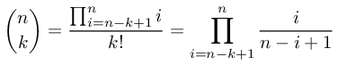
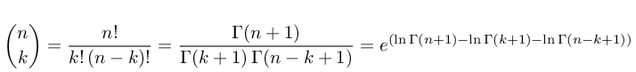
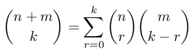

1. Binomial coefficient computation ([bincoeff](#bincoeff))
2. Multinomial coefficient computation ([multicoeff](#multicoeff))

[](https://zenodo.org/badge/latestdoi/187116260)

<br/><br/>
---------
<br/><br/>

# bincoeff <a name="bincoeff"></a>
binomial coefficient computation

The following methods are available here:
1. Pascal recursion [pbincoeff.m](#pbincoeff) ([code](pbincoeff.m))
2. Rolfe recursion  [rbincoeff.m](#rbincoeff) ([code](rbincoeff.m))
3. Yannis iterative method [ybincoeff.m](#ybincoeff) ([code](ybincoeff.m))
4. Prime factorization [pfbincoeff.m](#pfbincoeff) ([code](pfbincoeff.m))
5. Gamma function [gbincoeff.m](#gbincoeff) ([code](gbincoeff.m))
6. FFT method [fftbincoeff.m](#fftbincoeff) ([code](fftbincoef.m))
7. DFT based method [fbincoeff.m](#fbincoeff) ([code](fbincoef.m))

Python implementation using the [bigfloat](https://pypi.org/project/bigfloat/) package for arbitrary-precision, which is a wrapper around the [GNU MPFR library](https://www.mpfr.org/).
1. Yannis iterative method [ybincoeff.py](#pyybincoeff) ([code](ybincoeff.py))
2. DFT based method [fbincoeff.py](#pyfbincoeff) ([code](fbincoeff.py))

Benchmatk procedures:
1. execution time benchmark [bincoeffbenchmark.m](#bincoeffbenchmarkerror)
2. execution time benchmark computing a list o values (fixed n) [bincoeffbenchmarkvector.m](#bincoeffbenchmarkvector)
3. error benchmark for large values of n [bincoeffbenchmarkerror.m](#bincoeffbenchmarkerror)

Floating-point precision in computing the factorial:
1. Direct implementation in C of a factorial as a product [factorial.c](#factorialc) ([code](factorial.c))


## pbincoeff.m <a name="pbincoeff"></a>
[see code here](pbincoeff.m)

This function implements the Pascal's recursion. 


```
octave:1> for n=0:10, for k=0:n, printf('%d\t',pbincoeff(n,k)); end; printf('\n'); end;
1	
1	1	
1	2	1	
1	3	3	1	
1	4	6	4	1	
1	5	10	10	5	1	
1	6	15	20	15	6	1	
1	7	21	35	35	21	7	1	
1	8	28	56	70	56	28	8	1	
1	9	36	84	126	126	84	36	9	1	
1	10	45	120	210	252	210	120	45	10	1	
```

## rbincoeff.m <a name="rbincoeff"></a>
[see code here](rbincoeff.m)

This function implements the Rolfe's recursion.

Timothy Rolfe, Binomial coefficient recursion, *Association for Computing Machinery (ACM)*, 33, 2, 2001.


```
octave:1> for n=0:10, for k=0:n, printf('%d\t',rbincoeff(n,k)); end; printf('\n'); end;
1	
1	1	
1	2	1	
1	3	3	1	
1	4	6	4	1	
1	5	10	10	5	1	
1	6	15	20	15	6	1	
1	7	21	35	35	21	7	1	
1	8	28	56	70	56	28	8	1	
1	9	36	84	126	126	84	36	9	1	
1	10	45	120	210	252	210	120	45	10	1	
```

## ybincoeff.m <a name="ybincoeff"></a>
[see code here](ybincoeff.m)

This function implements an iterative method proposed by Yannis Manolopoulos. It performs divisions and multiplications alternatively to avoid overflow.

Yannis Manolopoulos, Binomial coefficient recursion, *Association for Computing Machinery (ACM)*, 34, 4, 2002.



```
octave:1> for n=0:10, for k=0:n, printf('%d\t',ybincoeff(n,k)); end; printf('\n'); end;
1	
1	1	
1	2	1	
1	3	3	1	
1	4	6	4	1	
1	5	10	10	5	1	
1	6	15	20	15	6	1	
1	7	21	35	35	21	7	1	
1	8	28	56	70	56	28	8	1	
1	9	36	84	126	126	84	36	9	1	
1	10	45	120	210	252	210	120	45	10	1	
```

## pfbincoeff.m <a name="pfbincoeff"></a>
[see code here](pfbincoeff.m)

This method uses the same formulation used by Yannis but solve it by finding the prime factors in the denominator and cancel terms in the numerator.


```
octave:1> for n=0:10, for k=0:n, printf('%d\t',pfbincoeff(n,k)); end; printf('\n'); end;
1	
1	1	
1	2	1	
1	3	3	1	
1	4	6	4	1	
1	5	10	10	5	1	
1	6	15	20	15	6	1	
1	7	21	35	35	21	7	1	
1	8	28	56	70	56	28	8	1	
1	9	36	84	126	126	84	36	9	1	
1	10	45	120	210	252	210	120	45	10	1	
```

## gbincoeff.m <a name="gbincoeff"></a>
[see code here](gbincoeff.m)

This approach uses the gamma function to express the factorials.



```
octave:1> for n=0:10, for k=0:n, printf('%d\t',gbincoeff(n,k)); end; printf('\n'); end;
1	
1	1	
1	2	1	
1	3	3	1	
1	4	6	4	1	
1	5	10	10	5	1	
1	6	15	20	15	6	1	
1	7	21	35	35	21	7	1	
1	8	28	56	70	56	28	8	1	
1	9	36	84	126	126	84	36	9	1	
1	10	45	120	210	252	210	120	45	10	1	

```


## fftbincoeff.m <a name="fftbincoeff"></a>
[see code here](fftbincoeff.m)

This approach uses FFT to compute all binomial coefficients in a row for a given n.

Using the following convention,


we may write


```
octave:519> for n=0:10, disp(fftbincoeff(n)); end;
   1   0
   1   1
   1   2   1
   1   3   3   1
   1   4   6   4   1
    1    5   10   10    5    1
    1    6   15   20   15    6    1
    1    7   21   35   35   21    7    1
    1    8   28   56   70   56   28    8    1
     1     9    36    84   126   126    84    36     9     1
     1    10    45   120   210   252   210   120    45    10     1

```


## fbincoeff.m <a name="fbincoeff"></a>
[see code here](fbincoeff.m)

This approach uses DFT.


```
octave:520> for n=0:10, for k=0:n, printf('%d\t',fbincoeff(n,k)); end; printf('\n'); end;
1	
1	1	
1	2	1	
1	3	3	1	
1	4	6	4	1	
1	5	10	10	5	1	
1	6	15	20	15	6	1	
1	7	21	35	35	21	7	1	
1	8	28	56	70	56	28	8	1	
1	9	36	84	126	126	84	36	9	1	
1	10	45	120	210	252	210	120	45	10	1	
```


## ybincoeff.py <a name="pyybincoeff"></a>
[see code here](ybincoeff.py)

```
$ ./ybincoeff.py 1000 353 1003
25229445633065974235144080252055773735613043515311956893635594388544559689184803330180149528141512945359658556166399392346118918439771509194920459520556252295683805332098882502374636769258037666692232812592768678750591171883227016115891467430491067982639472436653138035382214107000
```


## fbincoeff.py <a name="pyfbincoeff"></a>
[see code here](fbincoeff.py)

```
$ ./fbincoeff.py 1000 353 1003
25229445633065974235144080252055773735613043515311956893635594388544559689184803330180149528141512945359658556166399392346118918439771509194920459520556252295683805332098882502374636769258037666692232812592768678750591171883227016115891467430491067982639472436653138035382214107000
```

## bincoeffbenchmark.m <a name="bincoeffbenchmarkerror"></a>
[see code here](bincoeffbenchmark.m)

execution time benchmark


## bincoeffbenchmarkvector.m <a name="bincoeffbenchmarkvector"></a>
[see code here](bincoeffbenchmarkvector.m)

execution time benchmark computing a list o values (fixed n)


## bincoeffbenchmarkerror.m <a name="bincoeffbenchmarkerror"></a>
[see code here](bincoeffbenchmarkerror.m)

error benchmark for large values of n


## factorial.c <a name="factorialc"></a>
[see code here](factorial.c)
```
$ gcc factorial.c -o factorial
$ for k in $(seq 1 100); do ./factorial $k; done > factorial_c.txt
$ paste factorial.txt factorial_c.txt | nl | head -n 23 
     1	1	1	1
     2	2	2	2
     3	6	6	6
     4	24	24	24
     5	120	120	120
     6	720	720	720
     7	5040	5040	5040
     8	40320	40320	40320
     9	362880	362880	362880
    10	3628800	3628800	3628800
    11	39916800	39916800	39916800
    12	479001600	479001600	479001600
    13	6227020800	6227020800	6227020800
    14	87178291200	87178289152	87178291200
    15	1307674368000	1307674279936	1307674368000
    16	20922789888000	20922788478976	20922789888000
    17	355687428096000	355687414628352	355687428096000
    18	6402373705728000	6402373530419200	6402373705728000
    19	121645100408832000	121645096004222976	121645100408832000
    20	2432902008176640000	2432902023163674624	2432902008176640000
    21	51090942171709440000	51090940837169725440	51090942171709440000
    22	1124000727777607680000	1124000724806013026304	1124000727777607680000
    23	25852016738884976640000	25852017444594485559296	25852016738884978212864
```


# multicoeff <a name="multicoeff"></a>
multinomial coefficient computation


The following methods are available here:
1. Generalized Pascal's recursion [rmulticoeff.m](#rmulticoeff) ([code](rmulticoeff.m))
2. FFT accelerated Rolfe's recursion method  [armulticoeff.m](#armulticoeff) ([code](armulticoeff.m))
3. FFT accelerated Vandermonde's convolution [vfmulticoeff.m](#vfmulticoeff) ([code](vfmulticoeff.m))


## rmulticoeff.m <a name="rmulticoeff"></a>
[see code here](rmulticoeff.m)

This function implements the generalized Pascal's recursion to compute multinomials coefficients. 


```
octave:1> tic; c = rmulticoeff ([1 2 3]); toc, c
Elapsed time is 0.0132861 seconds.
c = 60
octave:2> tic; c = rmulticoeff ([3 4 5]); toc, c
Elapsed time is 2.6084 seconds.
c = 27720
octave:3> tic; c = rmulticoeff ([5 5 5]); toc, c
Elapsed time is 70.7959 seconds.
c = 756756
```


## armulticoeff.m <a name="armulticoeff"></a>
[see code here](armulticoeff.m)

Using the following relation


we note that the first coefficient is one. We may compute the second using FFT method (computing all coeffcients for the given level). The following coefficients in the equation above are computed by a recursion that goes until the level of the second coefficient (it is not necessary to go all the way up, if the coefficients at a given level are already computed).

```
octave:1> tic; c = armulticoeff ([5 5 5]); toc, c
Elapsed time is 0.00154495 seconds.
c = 756756
octave:2> tic; c = armulticoeff ([10 10 10]); toc, c
Elapsed time is 0.0024488 seconds.
c = 5550996791340
```


## vfmulticoeff.m <a name="vfmulticoeff"></a>
[see code here](vfmulticoeff.m)

Using the following relation, we may compute the multinomial coefficient by a product of binomial coefficients.


The first coefficient is one and the second is computed by FFT. The following coeffcieints might be computed by a Chu-Vandermonde's convolution:



We realize that these coefficients might be computed by FFT just peforming a cumulative product (convolution in FFT domain).

```
octave:1> tic; c = vfmulticoeff ([10 10 10]); toc, c
Elapsed time is 0.00150704 seconds.
c = 5550996791340
```

