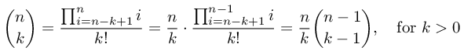
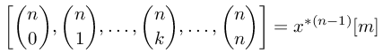

# bincoeff
binomial coefficient computation

the following methods are available here:
1. Pascal recursion [pbincoeff.m](#pbincoeff) [code](pbincoeff.m)
2. Rolfe recursion  [rbincoeff.m](#rbincoeff) [code](rbincoeff.m)
3. Yannis iterative method [ybincoeff.m](#ybincoeff) [code](ybincoeff.m)
4. Prime factorization [pfbincoeff.m](#pfbincoeff) [code](pfbincoeff.m)
5. Gamma function [gbincoeff.m](#gbincoeff) [code](gbincoeff.m)
6. FFT method [fftbincoeff.m](#fftbincoeff) [code](fftbincoef.m)
7. DFT based method [fbincoeff.m](#fbincoeff) [code](fbincoef.m)

Python implementation using the [bigfloat](https://pypi.org/project/bigfloat/) package for arbitrary-precision, which is a wrapper around the [GNU MPFR library](https://www.mpfr.org/).
1. Yannis iterative method [ybincoeff.py](#pyybincoeff)[code](ybincoeff.py)
2. DFT based method [fbincoeff.py](#pyfbincoeff)[code](fbincoeff.py)

Benchmatk procedures
1. execution time benchmark [bincoeffbenchmark.m](#bincoeffbenchmarkerror)
2. execution time benchmark computing a list o values (fixed n) [bincoeffbenchmarkvector.m](#bincoeffbenchmarkvector)
3. error benchmark for large values of n [bincoeffbenchmarkerror.m](#bincoeffbenchmarkerror)


## pbincoeff.m <a name="pbincoeff"></a>
[see code here](pbincoeff.m)

This function implements the Pascal's recursion. 


```
octave:1> for n=0:10, for k=0:n, printf('%d\t',pbincoeff(n,k)); end; printf('\n'); end;
1	
1	1	
1	2	1	
1	3	3	1	
1	4	6	4	1	
1	5	10	10	5	1	
1	6	15	20	15	6	1	
1	7	21	35	35	21	7	1	
1	8	28	56	70	56	28	8	1	
1	9	36	84	126	126	84	36	9	1	
1	10	45	120	210	252	210	120	45	10	1	
```

## rbincoeff.m <a name="rbincoeff"></a>
[see code here](rbincoeff.m)

This function implements the Rolfe's recursion.

Timothy Rolfe, Binomial coefficient recursion, *Association for Computing Machinery (ACM)*, 33, 2, 2001.



```
octave:1> for n=0:10, for k=0:n, printf('%d\t',rbincoeff(n,k)); end; printf('\n'); end;
1	
1	1	
1	2	1	
1	3	3	1	
1	4	6	4	1	
1	5	10	10	5	1	
1	6	15	20	15	6	1	
1	7	21	35	35	21	7	1	
1	8	28	56	70	56	28	8	1	
1	9	36	84	126	126	84	36	9	1	
1	10	45	120	210	252	210	120	45	10	1	
```

## ybincoeff.m <a name="ybincoeff"></a>
[see code here](ybincoeff.m)

This function implements an iterative method proposed by Yannis Manolopoulos. It performs divisions and multiplications alternatively to avoid overflow.

Yannis Manolopoulos, Binomial coefficient recursion, *Association for Computing Machinery (ACM)*, 34, 4, 2002.


```
octave:1> for n=0:10, for k=0:n, printf('%d\t',ybincoeff(n,k)); end; printf('\n'); end;
1	
1	1	
1	2	1	
1	3	3	1	
1	4	6	4	1	
1	5	10	10	5	1	
1	6	15	20	15	6	1	
1	7	21	35	35	21	7	1	
1	8	28	56	70	56	28	8	1	
1	9	36	84	126	126	84	36	9	1	
1	10	45	120	210	252	210	120	45	10	1	
```

## pfbincoeff.m <a name="pfbincoeff"></a>
[see code here](pfbincoeff.m)

This method uses the same formulation used by Yannis but solve it by finding the prime factors in the denominator and cancel terms in the numerator.


```
octave:1> for n=0:10, for k=0:n, printf('%d\t',pfbincoeff(n,k)); end; printf('\n'); end;
1	
1	1	
1	2	1	
1	3	3	1	
1	4	6	4	1	
1	5	10	10	5	1	
1	6	15	20	15	6	1	
1	7	21	35	35	21	7	1	
1	8	28	56	70	56	28	8	1	
1	9	36	84	126	126	84	36	9	1	
1	10	45	120	210	252	210	120	45	10	1	
```

## gbincoeff.m <a name="gbincoeff"></a>
[see code here](gbincoeff.m)

This approach uses the gamma function to express the factorials.


```
octave:1> for n=0:10, for k=0:n, printf('%d\t',gbincoeff(n,k)); end; printf('\n'); end;
1	
1	1	
1	2	1	
1	3	3	1	
1	4	6	4	1	
1	5	10	10	5	1	
1	6	15	20	15	6	1	
1	7	21	35	35	21	7	1	
1	8	28	56	70	56	28	8	1	
1	9	36	84	126	126	84	36	9	1	
1	10	45	120	210	252	210	120	45	10	1	

```


## fftbincoeff.m <a name="fftbincoeff"></a>
[see code here](fftbincoeff.m)

This approach uses FFT to compute all binomial coefficients in a row for a given n.

Using the following convention,


we may write




```
octave:519> for n=0:10, disp(fftbincoeff(n)); end;
   1   0
   1   1
   1   2   1
   1   3   3   1
   1   4   6   4   1
    1    5   10   10    5    1
    1    6   15   20   15    6    1
    1    7   21   35   35   21    7    1
    1    8   28   56   70   56   28    8    1
     1     9    36    84   126   126    84    36     9     1
     1    10    45   120   210   252   210   120    45    10     1

```


## fbincoeff.m <a name="fbincoeff"></a>
[see code here](fbincoeff.m)

This approach uses DFT.


```
octave:520> for n=0:10, for k=0:n, printf('%d\t',fbincoeff(n,k)); end; printf('\n'); end;
1	
1	1	
1	2	1	
1	3	3	1	
1	4	6	4	1	
1	5	10	10	5	1	
1	6	15	20	15	6	1	
1	7	21	35	35	21	7	1	
1	8	28	56	70	56	28	8	1	
1	9	36	84	126	126	84	36	9	1	
1	10	45	120	210	252	210	120	45	10	1	
```


## ybincoeff.py <a name="pyybincoeff"></a>
[see code here](ybincoeff.py)

```
$ ./ybincoeff.py 1000 353 1003
25229445633065974235144080252055773735613043515311956893635594388544559689184803330180149528141512945359658556166399392346118918439771509194920459520556252295683805332098882502374636769258037666692232812592768678750591171883227016115891467430491067982639472436653138035382214107000
```


## fbincoeff.py <a name="pyfbincoeff"></a>
[see code here](fbincoeff.py)

```
$ ./fbincoeff.py 1000 353 1003
25229445633065974235144080252055773735613043515311956893635594388544559689184803330180149528141512945359658556166399392346118918439771509194920459520556252295683805332098882502374636769258037666692232812592768678750591171883227016115891467430491067982639472436653138035382214107000
```

## bincoeffbenchmark.m <a name="bincoeffbenchmarkerror"></a>
[see code here](bincoeffbenchmark.m)

execution time benchmark


## bincoeffbenchmarkvector.m <a name="bincoeffbenchmarkvector"></a>
[see code here](bincoeffbenchmarkvector.m)

execution time benchmark computing a list o values (fixed n)


## bincoeffbenchmarkerror.m <a name="bincoeffbenchmarkerror"></a>
[see code here](bincoeffbenchmarkerror.m)

error benchmark for large values of n


